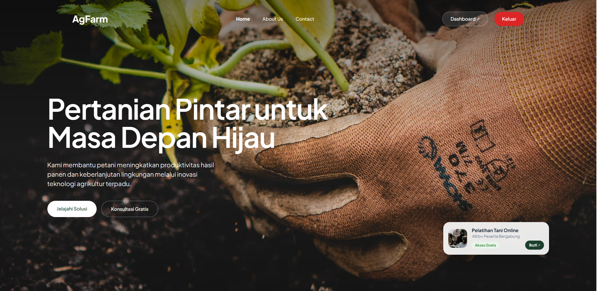
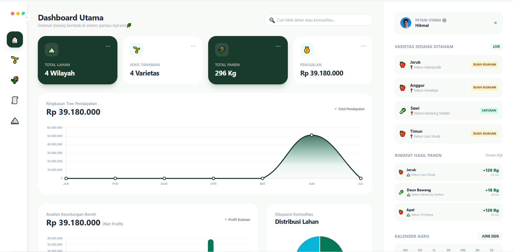
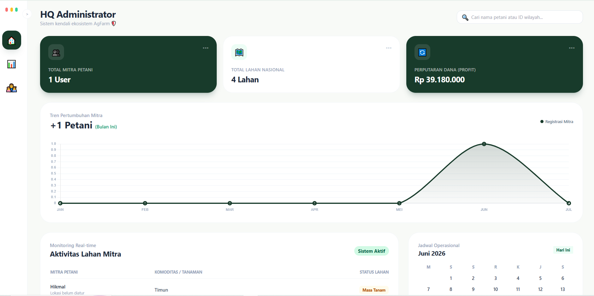
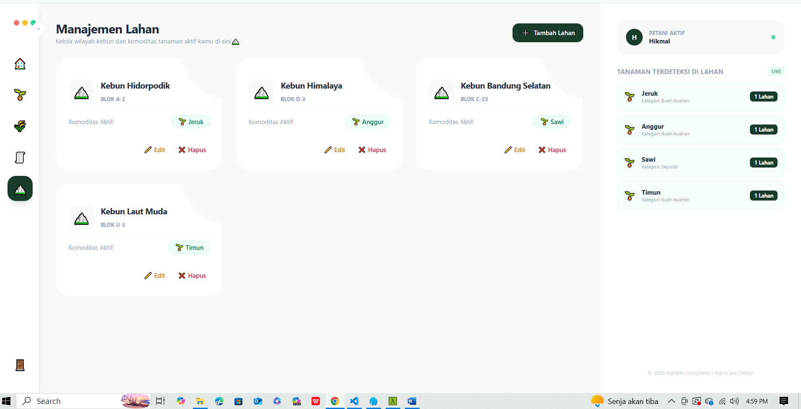
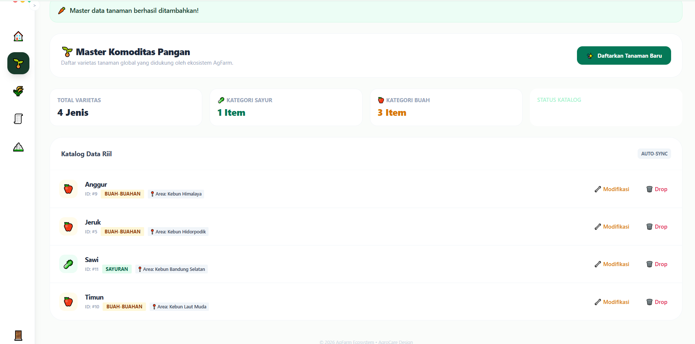
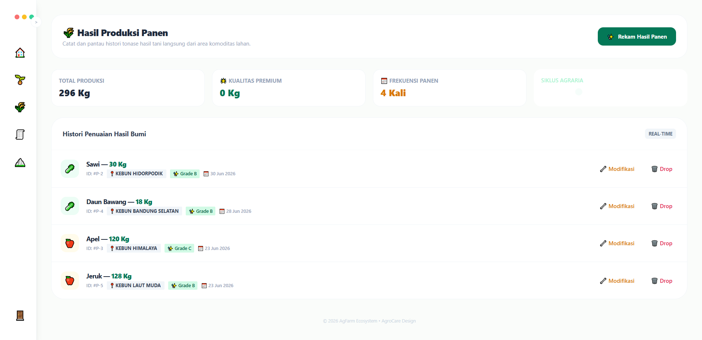
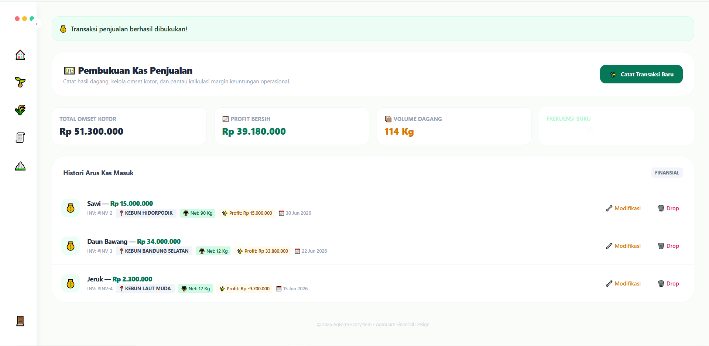
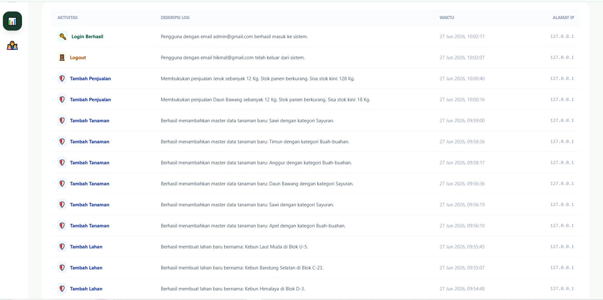
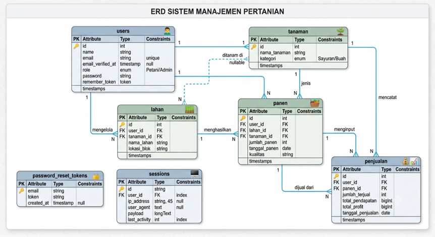

# 🌾 AgFarm - Sistem Manajemen Pertanian Digital

<p align="center">
  
  
  
  
</p>

---

### 📝 Deskripsi Singkat
> **AgFarm** adalah platform berbasis web inovatif yang dirancang untuk membantu petani utama dan mitra dalam mengelola distribusi lahan, memantau varietas tanaman secara *live*, serta mencatat transaksi dan riwayat hasil panen secara terstruktur menggunakan kalender agro.

---

## 🖥️ Modul & Tampilan Sistem

### 1. Halaman Home (Beranda Publik)
*Halaman awal penayangan profil AgFarm, informasi umum pertanian, dan gerbang masuk bagi pengguna.*


### 2. Dashboard Utama (Petani & Mitra)
*Halaman ringkasan data statis, grafik distribusi lahan, kalender agro, serta notifikasi sistem untuk petani dan mitra.*


### 3. Panel Administrasi (Halaman Admin)
*Halaman khusus super-admin untuk manajemen data pengguna, verifikasi pendaftaran akun petani/mitra, serta pengaturan konfigurasi global sistem AgFarm.*


### 4. Manajemen Lahan
*Modul khusus untuk memetakan distribusi lahan, mencatat kapasitas luas tanah, serta memantau status kondisi lahan (Aktif/Kosong).*


### 5. Sistem Tanaman & Varietas
*Tempat pengelolaan data komoditas pangan, melacak varietas yang sedang ditanam, serta estimasi masa waktu tanam secara *live*.*


### 6. Riwayat Hasil Panen
*Modul pencatatan total tonase hasil panen yang sukses ditimbang dan disinkronisasikan ke dalam kalender agro.*


### 7. Laporan & Penjualan
*Halaman pencatatan transaksi penjualan hasil bumi, grafik omzet, serta manajemen distribusi logistik ke mitra/pasar.*


### 8. Audit Log Sistem
*Halaman monitoring internal yang menampilkan riwayat aktivitas pengguna (siapa, melakukan aksi apa, pada data apa, dan kapan waktunya) guna kebutuhan audit keamanan data pertanian.*


---

## 🔒 Fitur Keamanan Sistem (Security Implemented)

Proyek ini dibangun dengan komitmen penuh terhadap keamanan data lewat implementasi **8 Parameter Keamanan Kritikal**:

| No | Parameter Keamanan | Implementasi pada AgFarm |
| :--- | :--- | :--- |
| 1 | **Authentication** | Proteksi penuh seluruh halaman inti (`/dashboard`, `/admin`, dll) menggunakan *middleware* auth bawaan Laravel. |
| 2 | **Authorization** | Pembatasan hak akses berbasis tingkat hak khusus (Admin vs Petani/Mitra) menggunakan *Spatie Roles* / *Laravel Gate*. |
| 3 | **Input Validation** | Validasi berlapis pada sisi server untuk menyaring data transaksi penjualan dan tonase panen dari karakter ilegal. |
| 4 | **CSRF Protection** | Mengamankan setiap transaksi form dari serangan pembajakan sesi melalui token CSRF otomatis. |
| 5 | **XSS Mitigation** | Mekanisme *auto-escaping* berbasis *Blade Engine* guna menetralisir injeksi skrip jahat pada input nama lahan. |
| 6 | **File Upload Security** | Filter ekstensi pada sisi klien (*Alpine.js*) dan validasi ketat tipe MIME pada sisi server untuk mencegah unggahan *backdoor*. |
| 7 | **Error Handling** | Menyembunyikan seluruh struktur *stack trace* kode di mode produksi (`APP_DEBUG=false`) guna mencegah kebocoran informasi server. |
| 8 | **Audit Trail** | Pencatatan otomatis riwayat aksi pengguna ke database internal serta perekaman error sistem di `storage/logs/laravel.log`. |

---

## 🗺️ Arsitektur Database (ERD)
Berikut adalah visualisasi relasi antar-tabel database yang menopang seluruh bisnis proses pada sistem AgFarm:



---

## 🚀 Cara Menjalankan di Lokal (Local Development Setup)

Ikuti langkah-langkah berikut untuk mengkloning dan menjalankan proyek AgFarm di komputer lokal Anda:

1. **Clone Repository**
   Kloning proyek ini dari GitHub dan otomatis menyimpannya ke dalam folder bernama **`pertanian`**:
   ```bash
   git clone [https://github.com/Hikmal-source/AgFarm.git](https://github.com/Hikmal-source/AgFarm.git) pertanian
